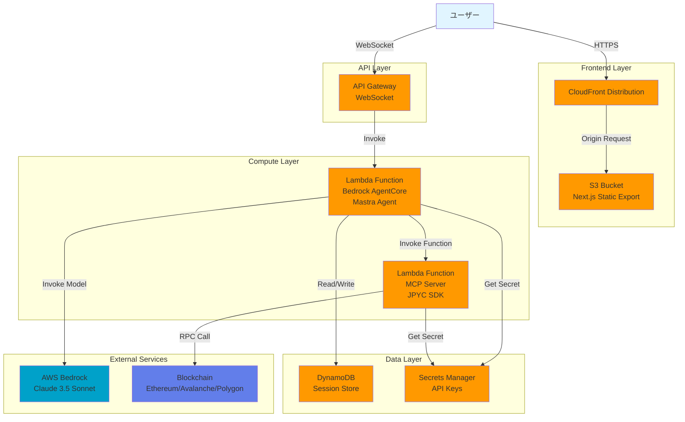
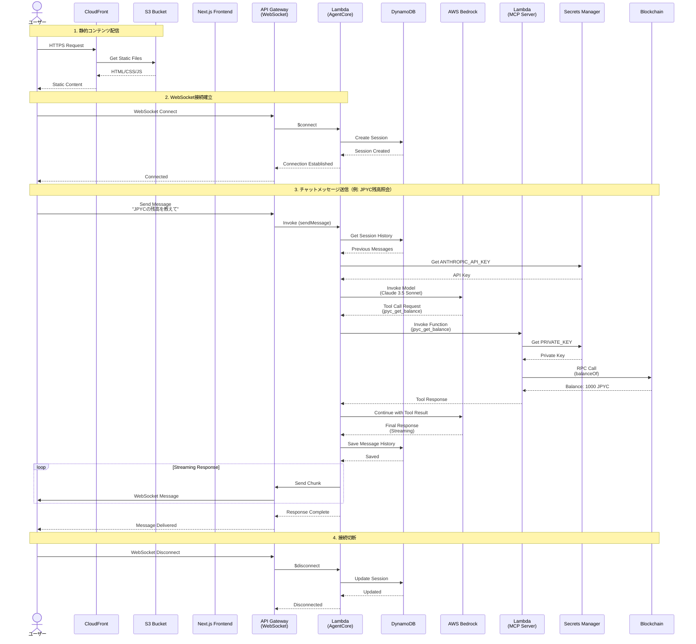

# Design Document

## Overview

JPYC AI AgentアプリケーションをAWS上にデプロイするための**完全サーバーレス**CDKインフラストラクチャ設計です。Next.js + Mastra + MCPで構築された既存のアプリケーションを、S3 + CloudFront + Lambda構成でデプロイします。

### アーキテクチャの選択理由

**完全サーバーレス構成**を採用する理由:
- **コスト効率**: 使用時のみ課金、常時起動リソースなし（月額約$20-30）
- **シンプル**: ECS/ALB/VPC/NAT Gatewayが不要
- **スケーラブル**: Lambda/CloudFrontの自動スケーリング
- **運用負荷低**: サーバー管理不要

**各コンポーネントの役割**:
- **S3 + CloudFront**: Next.js Static Export（HTML/CSS/JS）
- **Lambda (AgentCore)**: Mastra Agent実行（Bedrock AgentCore Runtime）
- **Lambda (MCP Server)**: JPYC SDK操作（Function URL経由）
- **DynamoDB**: セッション管理と会話履歴
- **API Gateway**: WebSocketでリアルタイム通信

## Architecture

### High-Level Architecture

```
┌────────────────────────────────────────────────────────────────┐
│                         AWS Cloud                               │
│                                                                  │
│  ┌────────────────────────────────────────────────────────────┐│
│  │              CloudFront Distribution                       ││
│  │  - HTTPS配信                                               ││
│  │  - グローバルキャッシング                                  ││
│  │  - カスタムドメイン対応                                    ││
│  └──────────────────┬─────────────────────────────────────────┘│
│                     │                                            │
│                     ▼                                            │
│  ┌────────────────────────────────────────────────────────────┐│
│  │              S3 Bucket (Static Website)                    ││
│  │  - Next.js Static Export                                   ││
│  │  - HTML/CSS/JS/Images                                      ││
│  │  - バージョニング有効                                      ││
│  └────────────────────────────────────────────────────────────┘│
│                                                                  │
│  ┌────────────────────────────────────────────────────────────┐│
│  │           API Gateway (WebSocket)                          ││
│  │  - wss:// エンドポイント                                  ││
│  │  - リアルタイム双方向通信                                  ││
│  └──────────────────┬─────────────────────────────────────────┘│
│                     │                                            │
│                     ▼                                            │
│  ┌────────────────────────────────────────────────────────────┐│
│  │      Lambda Function (Bedrock AgentCore)                   ││
│  │  - Mastra Agent実行                                        ││
│  │  - Claude 3.5 Sonnet                                       ││
│  │  - MCP Client統合                                          ││
│  └──────────┬──────────────────────┬──────────────────────────┘│
│             │                      │                            │
│             ▼                      ▼                            │
│  ┌──────────────────┐  ┌──────────────────────────────────────┐│
│  │  DynamoDB Table  │  │  Lambda Function (MCP Server)        ││
│  │  - Session Store │  │  - JPYC SDK操作                      ││
│  │  - Chat History  │  │  - Function URL                      ││
│  │  - TTL: 24h      │  │  - ブロックチェーン通信              ││
│  └──────────────────┘  └──────────────────────────────────────┘│
│                                                                  │
│  ┌──────────────────┐  ┌──────────────────┐                    │
│  │  Secrets Manager │  │  CloudWatch Logs │                    │
│  │  - PRIVATE_KEY   │  │  - Lambda Logs   │                    │
│  │  - ANTHROPIC_KEY │  │  - 7日間保持     │                    │
│  └──────────────────┘  └──────────────────┘                    │
│                                                                  │
└──────────────────────────────────────────────────────────────────┘
```

### Component Interaction Flow

1. **静的コンテンツ配信**: ユーザー → CloudFront → S3 (Next.js Static Export)
2. **WebSocket接続**: Frontend → API Gateway (WebSocket) → Lambda (AgentCore)
3. **AI処理**: Lambda (AgentCore) → Bedrock (Claude 3.5 Sonnet)
4. **ブロックチェーン操作**: Lambda (AgentCore) → Lambda (MCP Server) → JPYC SDK → Blockchain
5. **セッション管理**: Lambda (AgentCore) → DynamoDB (会話履歴保存)
6. **ストリーミングレスポンス**: Lambda → API Gateway → Frontend (リアルタイム)

### Architecture Diagram (Mermaid)



### Sequence Diagram (Mermaid)



## Components and Interfaces

### 1. S3 Bucket (Static Website Hosting)

#### Bucket Configuration
- **Name**: jpyc-ai-agent-frontend
- **Versioning**: 有効化（ロールバック用）
- **Encryption**: AES-256 (SSE-S3)
- **Public Access**: ブロック（CloudFront経由のみアクセス可能）
- **Lifecycle Policy**: 古いバージョンを30日後に削除

#### Static Export Content
- **Source**: Next.js Static Export (`next build && next export`)
- **Files**: HTML, CSS, JavaScript, Images, Fonts
- **Structure**:
  ```
  /index.html
  /_next/static/...
  /assets/...
  ```

#### Bucket Policy
- CloudFront Origin Access Identity (OAI) からのみアクセス許可
- 直接のパブリックアクセスは拒否

### 2. CloudFront Distribution

#### Configuration
- **Origin**: S3 Bucket (OAI経由)
- **Price Class**: PriceClass_All（グローバル配信）
- **Default Root Object**: index.html
- **HTTP Version**: HTTP/2, HTTP/3
- **Compression**: 有効化（Gzip, Brotli）

#### Cache Behavior
- **Default Behavior**:
  - Viewer Protocol Policy: Redirect HTTP to HTTPS
  - Allowed Methods: GET, HEAD, OPTIONS
  - Cached Methods: GET, HEAD
  - Cache Policy: CachingOptimized
  - TTL: Min 0, Default 86400 (1日), Max 31536000 (1年)

#### Custom Error Responses
- **404 Error**: /index.html (SPA routing対応)
- **403 Error**: /index.html (SPA routing対応)

#### SSL/TLS
- **Certificate**: AWS Certificate Manager (ACM)
- **Minimum Protocol Version**: TLSv1.2
- **Security Policy**: TLS-1.2-2021

### 3. API Gateway (WebSocket)

#### Configuration
- **Protocol**: WebSocket
- **Stage**: production
- **Routes**:
  - `$connect`: 接続確立時
  - `$disconnect`: 接続切断時
  - `sendMessage`: メッセージ送信
  - `$default`: デフォルトルート
- **Integration**: Lambda Function (Bedrock AgentCore)
- **Authorization**: IAM (または Cognito User Pools)

#### Throttling
- **Rate Limit**: 1000 requests/second
- **Burst Limit**: 2000 requests
- **Per-Client Limit**: 100 requests/second

#### Monitoring
- **CloudWatch Metrics**: 接続数、メッセージ数、エラー率
- **CloudWatch Logs**: 接続/切断ログ、エラーログ

### 4. Lambda Function (Bedrock AgentCore)

#### Configuration
- **Runtime**: Node.js 20.x
- **Memory**: 1024 MB (1 GB)
- **Timeout**: 300秒 (5分)
- **Architecture**: arm64 (Graviton2 - コスト効率)
- **Handler**: index.handler
- **Ephemeral Storage**: 512 MB
- **Reserved Concurrency**: なし（自動スケーリング）

#### Environment Variables
- `NODE_ENV=production`
- `JPYC_MCP_SERVER_URL` (MCP Server Lambda Function URL)
- `DYNAMODB_TABLE_NAME` (セッションテーブル名)
- `ANTHROPIC_API_KEY` (Secrets Managerから注入)

#### Lambda Function Code Structure
```typescript
// Mastra Agent with Bedrock AgentCore Runtime
import { Agent } from '@mastra/core';
import { createBedrockAgentCoreRuntime } from '@mastra/bedrock-agentcore';

const agent = new Agent({
  name: 'JPYC Assistant',
  model: 'claude-3-5-sonnet',
  tools: [jpycBalanceTool, jpycTransferTool, jpycChainSwitchTool],
});

export const handler = createBedrockAgentCoreRuntime({
  agent,
  sessionStore: dynamoDBSessionStore,
});
```

#### DynamoDB Session Store
- **Table Name**: jpyc-ai-agent-sessions
- **Partition Key**: sessionId (String)
- **Sort Key**: timestamp (Number)
- **TTL**: 24時間 (自動削除)
- **Billing Mode**: PAY_PER_REQUEST (オンデマンド)
- **Attributes**:
  - sessionId: ユーザーセッションID
  - userId: ユーザー識別子
  - messages: 会話履歴 (JSON)
  - context: エージェントコンテキスト (JSON)
  - createdAt: 作成日時
  - updatedAt: 更新日時
  - ttl: 有効期限 (UNIX timestamp)

#### API Gateway (WebSocket)
- **Protocol**: WebSocket
- **Routes**:
  - `$connect`: 接続確立
  - `$disconnect`: 接続切断
  - `sendMessage`: メッセージ送信
  - `$default`: デフォルトルート
- **Integration**: Lambda Function (Bedrock AgentCore)
- **Authorization**: IAM (または Cognito)
- **Throttling**:
  - Rate: 1000 requests/second
  - Burst: 2000 requests

#### IAM Role (Execution Role)
- **Managed Policies**:
  - AWSLambdaBasicExecutionRole
- **Custom Policies**:
  - `bedrock:InvokeModel` (Claude 3.5 Sonnet)
  - `dynamodb:PutItem`, `dynamodb:GetItem`, `dynamodb:Query` (Session Table)
  - `secretsmanager:GetSecretValue` (API Keys)
  - `lambda:InvokeFunction` (MCP Server Lambda)
  - `logs:CreateLogGroup`, `logs:CreateLogStream`, `logs:PutLogEvents`

#### Layers
- **Mastra Runtime Layer**: Mastra + 依存関係
- **AWS SDK Layer**: AWS SDK v3 (最新版)

### 5. Lambda Function (MCP Server)

#### Configuration
- **Runtime**: Node.js 20.x
- **Memory**: 512 MB
- **Timeout**: 60秒
- **Architecture**: arm64 (Graviton2)
- **Handler**: index.handler
- **Function URL**: 有効化（HTTPS）

#### Environment Variables
- `NODE_ENV=production`
- `PRIVATE_KEY` (Secrets Managerから注入)

#### IAM Role (Execution Role)
- **Managed Policies**:
  - AWSLambdaBasicExecutionRole
- **Custom Policies**:
  - `secretsmanager:GetSecretValue` (PRIVATE_KEY)
  - `logs:CreateLogGroup`, `logs:CreateLogStream`, `logs:PutLogEvents`

#### Function URL Configuration
- **Auth Type**: AWS_IAM（AgentCore Lambdaからのみアクセス）
- **CORS**: 
  - Allow Origins: AgentCore Lambda
  - Allow Methods: POST
  - Allow Headers: Content-Type

#### MCP Tools
- `jpyc_get_balance`: 残高照会
- `jpyc_transfer`: 送金
- `jpyc_get_total_supply`: 総供給量照会
- `jpyc_switch_chain`: チェーン切り替え

### 6. DynamoDB Table (Session Store)

#### Configuration
- **Table Name**: jpyc-ai-agent-sessions
- **Partition Key**: sessionId (String)
- **Sort Key**: timestamp (Number)
- **Billing Mode**: PAY_PER_REQUEST (オンデマンド)
- **Point-in-Time Recovery**: 有効化
- **Encryption**: AWS Managed Key (SSE)

#### TTL Configuration
- **Attribute**: ttl
- **Expiration**: 24時間後に自動削除

#### Global Secondary Index (オプション)
- **Index Name**: userId-index
- **Partition Key**: userId
- **Sort Key**: createdAt
- **Projection**: ALL

### 7. Secrets Manager

#### Secrets
1. **jpyc-ai-agent/private-key**
   - Description: Ethereum private key for blockchain transactions
   - Rotation: 手動（テストネット用）

2. **jpyc-ai-agent/anthropic-api-key**
   - Description: Anthropic API key for Claude 3.5 Sonnet
   - Rotation: 手動

#### IAM Permissions
- AgentCore Lambda Execution Roleに`secretsmanager:GetSecretValue`権限を付与
- MCP Server Lambda Execution Roleに`secretsmanager:GetSecretValue`権限を付与
- リソースベースポリシーで特定のシークレットへのアクセスを制限

### 8. CloudWatch Logs

#### Log Groups
1. **/aws/lambda/jpyc-ai-agent-agentcore**
   - Retention: 7日間
   - Encryption: AWS Managed Key

2. **/aws/lambda/jpyc-ai-agent-mcp-server**
   - Retention: 7日間
   - Encryption: AWS Managed Key

3. **/aws/apigateway/jpyc-ai-agent-websocket**
   - Retention: 7日間
   - Encryption: AWS Managed Key

### 9. CloudWatch Alarms

#### AgentCore Lambda Alarms
1. **High Error Rate**
   - Metric: Errors
   - Threshold: > 10 errors/5分
   - Evaluation Periods: 1
   - Action: SNS通知（オプション）

2. **High Duration**
   - Metric: Duration
   - Threshold: > 240秒 (タイムアウト近く)
   - Evaluation Periods: 2
   - Action: SNS通知（オプション）

3. **Throttles**
   - Metric: Throttles
   - Threshold: > 0
   - Evaluation Periods: 1
   - Action: SNS通知（オプション）

#### MCP Server Lambda Alarms
1. **High Error Rate**
   - Metric: Errors
   - Threshold: > 5 errors/5分
   - Evaluation Periods: 1
   - Action: SNS通知（オプション）

2. **High Duration**
   - Metric: Duration
   - Threshold: > 50秒
   - Evaluation Periods: 2
   - Action: SNS通知（オプション）

#### CloudFront Alarms
1. **High 4xx Error Rate**
   - Metric: 4xxErrorRate
   - Threshold: > 5%
   - Evaluation Periods: 2
   - Action: SNS通知（オプション）

2. **High 5xx Error Rate**
   - Metric: 5xxErrorRate
   - Threshold: > 1%
   - Evaluation Periods: 2
   - Action: SNS通知（オプション）

## Data Models

### Environment Variables

#### Frontend (Next.js Build Time)
```typescript
interface FrontendEnv {
  NEXT_PUBLIC_AGENT_API_URL: string; // API Gateway WebSocket URL
  NEXT_PUBLIC_APP_VERSION: string; // Git commit hash
}
```

#### Lambda (Bedrock AgentCore)
```typescript
interface AgentCoreEnv {
  NODE_ENV: 'production';
  JPYC_MCP_SERVER_URL: string; // MCP Server Lambda Function URL
  DYNAMODB_TABLE_NAME: string; // Session table name
  ANTHROPIC_API_KEY: string; // from Secrets Manager
  AWS_REGION: string; // ap-northeast-1
}
```

#### Lambda (MCP Server)
```typescript
interface MCPServerEnv {
  NODE_ENV: 'production';
  PRIVATE_KEY: string; // from Secrets Manager
  AWS_REGION: string; // ap-northeast-1
}
```

### DynamoDB Session Schema

```typescript
interface SessionRecord {
  sessionId: string; // Partition Key
  timestamp: number; // Sort Key
  userId: string;
  messages: Array<{
    role: 'user' | 'assistant';
    content: string;
    timestamp: number;
  }>;
  context: {
    currentChain?: string;
    walletAddress?: string;
    lastAction?: string;
  };
  createdAt: string; // ISO 8601
  updatedAt: string; // ISO 8601
  ttl: number; // UNIX timestamp (24時間後)
}
```

### CDK Context

```typescript
interface CDKContext {
  // S3 & CloudFront
  domainName?: string; // optional: custom domain
  certificateArn?: string; // optional: ACM certificate ARN
  
  // Lambda Configuration
  agentCoreMemory: number; // default: 1024 MB
  agentCoreTimeout: number; // default: 300 seconds
  mcpServerMemory: number; // default: 512 MB
  mcpServerTimeout: number; // default: 60 seconds
  
  // Secrets
  privateKeySecretArn?: string; // optional: existing secret
  anthropicApiKeySecretArn?: string; // optional: existing secret
  
  // DynamoDB
  sessionTableBillingMode: 'PAY_PER_REQUEST' | 'PROVISIONED'; // default: PAY_PER_REQUEST
  sessionTtlHours: number; // default: 24
  
  // Deployment
  environment: 'dev' | 'staging' | 'production'; // default: 'production'
  region: string; // default: 'ap-northeast-1'
}
```

## Error Handling

### CloudFront / S3 Failures

#### Scenario: S3バケットへのアクセス失敗
- **Detection**: CloudFront 5xx errors
- **Recovery**:
  - CloudFrontキャッシュから配信（一時的）
  - S3バケットの権限確認
- **Prevention**:
  - OAI設定の確認
  - バケットポリシーの検証

#### Scenario: CloudFront配信エラー
- **Detection**: CloudWatch Alarms (5xxErrorRate)
- **Recovery**:
  - Invalidation実行
  - オリジンヘルスチェック
- **Prevention**:
  - 適切なキャッシュポリシー
  - エラーページの設定

### API Gateway Failures

#### Scenario: WebSocket接続切断
- **Detection**: Frontend接続エラー
- **Recovery**:
  - 自動再接続ロジック（exponential backoff）
  - セッションIDの保持
- **Prevention**:
  - Heartbeat/Ping-Pongの実装
  - 適切なタイムアウト設定（10分）

#### Scenario: スロットリング
- **Detection**: 429 Too Many Requests
- **Recovery**:
  - クライアント側でリトライ
  - レート制限の緩和
- **Prevention**:
  - 適切なスロットリング設定
  - クライアント側のレート制限

### Lambda Failures

#### Scenario: MCP Serverへの接続失敗
- **Detection**: AgentCore Lambda Logs
- **Recovery**:
  - Retry Logic (exponential backoff)
  - Circuit Breaker Pattern
- **Prevention**:
  - MCP Server Lambda のヘルスチェック
  - タイムアウト設定の最適化

#### Scenario: 外部API (Bedrock, RPC) への接続失敗
- **Detection**: Lambda Logs
- **Recovery**:
  - Retry Logic with timeout
  - Fallback Response
- **Prevention**:
  - 適切なタイムアウト設定
  - エラーハンドリングの実装

### Secrets Manager Failures

#### Scenario: シークレット取得失敗
- **Detection**: Lambda実行エラー
- **Recovery**:
  - IAM Roleの権限確認
  - シークレットの存在確認
- **Prevention**:
  - CDKデプロイ前にシークレット作成
  - IAM Policyの適切な設定

### Lambda Failures

#### Scenario: Lambda関数がタイムアウト
- **Detection**: CloudWatch Logs, Lambda Duration Metric
- **Recovery**:
  - タイムアウト設定を延長
  - 処理の最適化
- **Prevention**:
  - 適切なタイムアウト設定 (300秒)
  - 非同期処理の活用

#### Scenario: Lambda同時実行数制限
- **Detection**: Throttles Metric
- **Recovery**:
  - Reserved Concurrencyの設定
  - リトライロジックの実装
- **Prevention**:
  - 適切な同時実行数の設定
  - リクエストレート制限

### DynamoDB Failures

#### Scenario: DynamoDB書き込み失敗
- **Detection**: Lambda実行エラー
- **Recovery**:
  - Exponential Backoffでリトライ
  - IAM権限の確認
- **Prevention**:
  - PAY_PER_REQUESTモードで容量制限を回避
  - 適切なIAM Policy設定

### API Gateway Failures

#### Scenario: WebSocket接続切断
- **Detection**: Frontend接続エラー
- **Recovery**:
  - 自動再接続ロジック
  - セッションIDの保持
- **Prevention**:
  - Heartbeat/Ping-Pongの実装
  - 適切なタイムアウト設定

## Testing Strategy

### Unit Tests

#### CDK Stack Tests
- **Framework**: Jest + AWS CDK Assertions
- **Coverage**:
  - VPC構成の検証
  - ECS Task Definitionの検証
  - Lambda Function設定の検証
  - API Gateway設定の検証
  - DynamoDB Table設定の検証
  - Security Groupルールの検証
  - IAM Roleとポリシーの検証

```typescript
// Example Test
test('S3 Bucket has correct configuration', () => {
  const template = Template.fromStack(stack);
  
  template.hasResourceProperties('AWS::S3::Bucket', {
    VersioningConfiguration: {
      Status: 'Enabled',
    },
    PublicAccessBlockConfiguration: {
      BlockPublicAcls: true,
      BlockPublicPolicy: true,
      IgnorePublicAcls: true,
      RestrictPublicBuckets: true,
    },
  });
});

test('CloudFront Distribution has correct configuration', () => {
  const template = Template.fromStack(stack);
  
  template.hasResourceProperties('AWS::CloudFront::Distribution', {
    DistributionConfig: {
      Enabled: true,
      HttpVersion: 'http2and3',
      DefaultRootObject: 'index.html',
    },
  });
});

test('AgentCore Lambda has correct configuration', () => {
  const template = Template.fromStack(stack);
  
  template.hasResourceProperties('AWS::Lambda::Function', {
    Runtime: 'nodejs20.x',
    MemorySize: 1024,
    Timeout: 300,
    Architectures: ['arm64'],
  });
});

test('DynamoDB Table has TTL enabled', () => {
  const template = Template.fromStack(stack);
  
  template.hasResourceProperties('AWS::DynamoDB::Table', {
    TimeToLiveSpecification: {
      Enabled: true,
      AttributeName: 'ttl',
    },
  });
});
```

### Integration Tests

#### Infrastructure Tests
- **Tool**: CDK Synth + CloudFormation Validation
- **Tests**:
  - CloudFormationテンプレートの構文検証
  - リソース間の依存関係検証
  - タグとネーミング規則の検証

#### Deployment Tests
- **Environment**: 開発環境
- **Tests**:
  - CDK Deployの成功確認
  - S3バケットへのファイルアップロード確認
  - CloudFront Distributionの作成確認
  - Lambda Functionのデプロイ確認
  - API Gateway WebSocketの接続確認
  - DynamoDB Tableの作成確認
  - Secrets Managerからのシークレット取得確認

### End-to-End Tests

#### Application Tests
- **Tool**: Playwright / Cypress
- **Scenarios**:
  1. CloudFront経由でフロントエンドへのアクセス
  2. 静的アセット（CSS/JS/画像）の読み込み
  3. WebSocket接続の確立
  4. チャットインターフェースの動作
  5. ストリーミングレスポンスの受信
  6. JPYC残高照会
  7. JPYC送金（テストネット）
  8. チェーン切り替え
  9. セッション永続化の確認
  10. ページリロード後のセッション復元

#### Load Tests
- **Tool**: Artillery / k6
- **Scenarios**:
  - 同時接続数: 100ユーザー
  - リクエスト/秒: 50
  - Auto Scalingの動作確認

### Security Tests

#### Vulnerability Scanning
- **Tool**: ECR Image Scanning
- **Frequency**: プッシュ時
- **Action**: 重大な脆弱性が見つかった場合はデプロイをブロック

#### Penetration Testing
- **Scope**:
  - ALBへの不正アクセス試行
  - Security Groupルールの検証
  - Secrets Managerへのアクセス制御

## Deployment Strategy

### Pre-Deployment

1. **Secrets作成**
   ```bash
   aws secretsmanager create-secret \
     --name jpyc-ai-agent/private-key \
     --secret-string "0x..." \
     --region ap-northeast-1
   
   aws secretsmanager create-secret \
     --name jpyc-ai-agent/anthropic-api-key \
     --secret-string "sk-ant-..." \
     --region ap-northeast-1
   ```

2. **Next.js Static Export**
   ```bash
   cd pkgs/frontend
   
   # next.config.jsに output: 'export' を追加
   # NEXT_PUBLIC_AGENT_API_URL を設定
   
   pnpm install
   pnpm run build
   # outディレクトリに静的ファイルが生成される
   ```

3. **Lambda関数のビルド**
   ```bash
   # AgentCore Lambda
   cd pkgs/agentcore
   pnpm install
   pnpm run build
   # CDKがLambda Layerとして自動パッケージング
   
   # MCP Server Lambda
   cd pkgs/mcp
   pnpm install
   pnpm run build
   # CDKがLambda関数としてデプロイ
   ```

### Deployment

1. **CDK Bootstrap** (初回のみ)
   ```bash
   cd pkgs/cdk
   pnpm run cdk bootstrap
   ```

2. **CDK Synth** (テンプレート生成)
   ```bash
   pnpm run cdk synth
   ```

3. **CDK Diff** (変更確認)
   ```bash
   pnpm run cdk diff
   ```

4. **CDK Deploy**
   ```bash
   pnpm run cdk deploy
   ```

### Post-Deployment

1. **動作確認**
   - CloudFront Distribution URLにアクセス
   - フロントエンドの表示確認
   - 静的アセットの読み込み確認
   - WebSocket接続の確認
   - チャット機能の動作確認
   - ストリーミングレスポンスの確認

2. **ログ確認**
   ```bash
   aws logs tail /aws/lambda/jpyc-ai-agent-agentcore --follow --region ap-northeast-1
   aws logs tail /aws/lambda/jpyc-ai-agent-mcp-server --follow --region ap-northeast-1
   ```

3. **メトリクス確認**
   - CloudWatch Dashboardでメトリクス確認
   - Lambda実行時間とエラー率の確認
   - DynamoDBの読み書き容量の確認
   - CloudFrontのキャッシュヒット率確認

4. **エンドポイント確認**
   ```bash
   # CloudFront Distribution URL
   aws cloudfront list-distributions \
     --query 'DistributionList.Items[?Comment==`jpyc-ai-agent-frontend`].DomainName' \
     --output text
   
   # WebSocket URL
   aws apigatewayv2 get-apis \
     --query 'Items[?Name==`jpyc-ai-agent-websocket`].ApiEndpoint' \
     --output text
   
   # MCP Server Lambda Function URL
   aws lambda get-function-url-config \
     --function-name jpyc-ai-agent-mcp-server \
     --query 'FunctionUrl' \
     --output text
   ```

### Rollback Strategy

#### Scenario: デプロイ失敗
```bash
# CloudFormationスタックをロールバック
aws cloudformation cancel-update-stack --stack-name JPYCAIAgentCoreCdkStack

# または前のバージョンにロールバック
pnpm run cdk deploy --rollback
```

#### Scenario: アプリケーションエラー
```bash
# S3: 前のバージョンにロールバック
aws s3 sync s3://jpyc-ai-agent-frontend/previous-version/ s3://jpyc-ai-agent-frontend/ --delete

# CloudFront: キャッシュ無効化
aws cloudfront create-invalidation \
  --distribution-id <distribution-id> \
  --paths "/*"

# Lambda: 前のバージョンにロールバック
aws lambda update-alias \
  --function-name jpyc-ai-agent-agentcore \
  --name live \
  --function-version <previous-version>

aws lambda update-alias \
  --function-name jpyc-ai-agent-mcp-server \
  --name live \
  --function-version <previous-version>
```

## Cost Estimation

### Monthly Cost Breakdown (東京リージョン)

#### S3 (Static Website Hosting)
- **Storage**: 1 GB × $0.025/GB = $0.025/月
- **PUT Requests**: 100 × $0.0047/1K = $0.0005/月
- **GET Requests**: CloudFront経由（無料）
- **Total**: 約$0.03/月

#### CloudFront
- **Data Transfer Out**: 10 GB × $0.114/GB = $1.14/月
- **HTTP Requests**: 100K × $0.0075/10K = $0.075/月
- **HTTPS Requests**: 100K × $0.010/10K = $0.10/月
- **Total**: 約$1.32/月

#### Lambda (AgentCore)
- **Requests**: 10,000 requests/月 × $0.0000002 = $0.002/月
- **Duration**: 10,000 × 30秒 × 1024MB × $0.0000166667 = 約$5/月
- **Total**: 約$5/月

#### Lambda (MCP Server)
- **Requests**: 20,000 requests/月 × $0.0000002 = $0.004/月
- **Duration**: 20,000 × 5秒 × 512MB × $0.0000166667 = 約$0.85/月
- **Total**: 約$0.85/月

#### Bedrock (Claude 3.5 Sonnet)
- **Input Tokens**: 1M tokens × $0.003/1K = $3/月
- **Output Tokens**: 500K tokens × $0.015/1K = $7.50/月
- **Total**: 約$10.50/月

#### DynamoDB
- **Storage**: 1 GB × $0.25/GB = $0.25/月
- **On-Demand Requests**: 100K reads × $0.25/1M + 50K writes × $1.25/1M = 約$0.09/月
- **Total**: 約$0.34/月

#### API Gateway (WebSocket)
- **Messages**: 100K messages × $1.00/1M = $0.10/月
- **Connection Minutes**: 10,000分 × $0.25/1M = 約$0.003/月
- **Total**: 約$0.10/月

#### Secrets Manager
- **Secrets**: 2 × $0.40/月 = $0.80/月
- **API Calls**: 約$0.05/月
- **Total**: 約$0.85/月

#### CloudWatch
- **Logs**: 2 GB × $0.50/GB = $1.00/月
- **Metrics**: 約$0.50/月
- **Total**: 約$1.50/月

### Total Monthly Cost
**約$20-25/月** (学習用アプリケーションとして)

### Cost Comparison
- **従来のECS + ALB + NAT Gateway構成**: 約$193/月
- **ECS + AgentCore構成**: 約$156/月
- **完全サーバーレス構成**: 約$20-25/月
- **削減額**: 約$170/月 (88%削減！)

### Cost Optimization Tips
1. **CloudFront Cache**: TTLを長くしてオリジンリクエストを削減
2. **Lambda Arm64**: Graviton2で20%コスト削減
3. **DynamoDB TTL**: 古いセッションを自動削除してストレージコストを削減
4. **CloudWatch Logs保持期間**: 7日間に制限
5. **S3 Intelligent-Tiering**: アクセス頻度に応じて自動的にストレージクラスを変更
6. **Lambda Provisioned Concurrency**: 予測可能なトラフィックの場合はSavings Plansを検討

## Security Considerations

### Network Security
- CloudFront OAIでS3への直接アクセスをブロック
- HTTPS強制（HTTP → HTTPS リダイレクト）
- Lambda Function URLはIAM認証
- API Gateway WebSocketはIAM認証（またはCognito）

### Data Security
- S3バケット暗号化（SSE-S3）
- Secrets Managerで機密情報を暗号化
- CloudWatch Logsの暗号化（AWS Managed Key）
- DynamoDB暗号化（AWS Managed Key）
- TLS 1.2以上の強制

### Access Control
- IAM Roleで最小権限の原則
- Lambda Execution Roleの適切な権限設定
- S3バケットポリシーでCloudFront OAIのみ許可
- API Gatewayの認証・認可 (IAMまたはCognito)
- DynamoDBへのアクセス制限
- CloudFormationスタックへのアクセス制限

### Content Security
- CloudFront Custom Headers（X-Frame-Options, X-Content-Type-Options）
- Content Security Policy (CSP) の設定
- CORS設定の適切な制限

### Compliance
- テストネット専用（本番環境では追加の考慮が必要）
- ログの適切な保持期間設定（7日間）
- 定期的なセキュリティレビュー
- AWS WAFの導入検討（DDoS対策）
