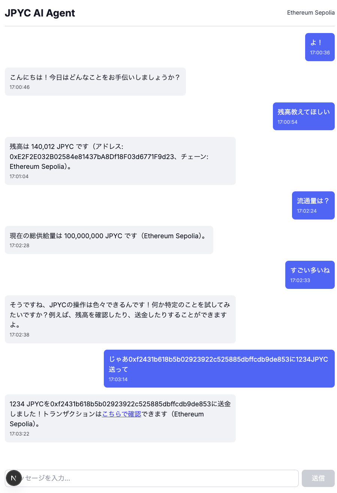

# JPYC AI Agent

自然言語でJPYCトークンを操作できるAIチャットアプリケーション



---

## 📖 概要

JPYC AI Agentは、チャットで指示を送るだけでJPYC（日本円ステーブルコイン）の送金や残高照会ができるAIアシスタントです。ブロックチェーンの複雑な操作を自然言語で実行できます。

---

## 🎯 主要機能

### 自然言語でのJPYC操作
- 💬 「0x123...に100JPYC送って」のような会話で送金可能
- 🔄 「Polygon Amoyに切り替えて」でチェーン変更
- 💰 「残高教えて」で即座に残高確認
- 📊 「流通量は？」で総供給量を照会

### マルチチェーン対応
- ✅ **Ethereum Sepolia** (推奨・動作確認済み)
- ⚠️ Polygon Amoy (未確認)
- ⚠️ Avalanche Fuji (未確認)

### トランザクション追跡
- 送金後、自動的にエクスプローラーリンクを生成
- ワンクリックでトランザクション詳細を確認可能

### AIアシスタント機能
- OpenAI gpt-4o-mini による自然言語解釈
- Mastra フレームワークでツール統合
- MCP (Model Context Protocol) でブロックチェーン操作

---

## 🚀 事前準備

### 1. 環境変数のテンプレートファイルを作成する

```bash
cp .env.local.example .env.local
```

セットアップが必要な環境変数は以下の通り：

```bash
# JPYC SDK Configuration
# ⚠️ 本番環境では絶対に使用しないでください！テストネット専用です
PRIVATE_KEY=0x... # テストネット用の秘密鍵

# AI API Keys
OPENAI_API_KEY=sk-proj-... # OpenAI APIキー
```

### 2. OpenAI APIキーを発行すること

[OpenAI Platform](https://platform.openai.com/) にアクセスしてAPIキーを発行してください。

#### OpenAI APIキーの設定例

1. **OpenAI Platform にアクセス**
   - https://platform.openai.com/ にアクセス

2. **アカウントを作成またはログイン**
   - 新規の場合はサインアップ

3. **API Keysセクションで新しいキーを作成**
   - ダッシュボード → API Keys → Create new secret key

4. **生成されたAPIキーを取得する**
   - `sk-proj-...` の形式のキーをコピー

5. **APIキーを環境変数に設定**
   ```bash
   OPENAI_API_KEY=sk-proj-...
   ```

### 3. テストネット用ウォレットの秘密鍵を設定する

⚠️ **重要**: 本番環境のウォレットは絶対に使用しないでください

1. **テストネット専用のウォレットを作成**
   - MetaMaskなどで新しいウォレットを作成

2. **秘密鍵をエクスポート**
   - MetaMask → アカウント詳細 → 秘密鍵のエクスポート

3. **秘密鍵を環境変数に設定**
   ```bash
   PRIVATE_KEY=0x...
   ```

### 4. テストネットトークンを取得する

#### Ethereum Sepolia（推奨）
- [Sepolia Faucet](https://sepoliafaucet.com/) でSepoliaETHを取得
- ガス代として使用されます

#### JPYC テストトークン
- [JPYC Faucet](https://faucet.jpyc.jp/login)でJPYC テストトークンを取得

*こちらはJPYC Prepaid版のFaucetです。資金移動業版リリースまでは今しばらくお待ちください。*

---

## 🛠️ セットアップ

### リポジトリのクローン

```bash
git clone --recurse-submodules https://github.com/YOUR_USERNAME/jpyc-ai-agent.git
cd jpyc-ai-agent
```

### クローンした後に git submodulesを追加するコマンド

```bash
git submodule update --init --recursive
```

### インストール

```bash
pnpm install
```

JPYC SDKはGit submoduleとして`external/jpyc-sdk`に配置されています。

### ビルド

```bash
pnpm build
```

### 起動

**必ずビルドした後に実行してください！**

```bash
pnpm run dev
```

アプリケーションが `http://localhost:3000` で起動します。

### フォーマッター適用（オプション）

```bash
pnpm format
```

---

## 💡 動かし方

### 基本的な使い方

アプリケーションを起動すると、チャット画面が表示されます。
自然言語で指示を入力するだけで、JPYC操作が可能です。

### 会話例

#### 1. 残高照会

```
ユーザー: 残高教えて
アシスタント: Ethereum Sepoliaチェーンの残高は 1,000 JPYC です
```

#### 2. 特定アドレスの残高照会

```
ユーザー: 0x742d35Cc6634C0532925a3b844Bc9e7595f0bEbの残高を教えて
アシスタント: Ethereum Sepoliaチェーンの残高は 500 JPYC です
```

#### 3. 送金

```
ユーザー: 0x742d35Cc6634C0532925a3b844Bc9e7595f0bEbに100JPYC送って
アシスタント: 0x742d35Cc...に 100 JPYC送りました！
トランザクションは[こちらで確認](https://sepolia.etherscan.io/tx/0x...)できます（Ethereum Sepolia）
```

#### 4. 総供給量照会

```
ユーザー: 流通量教えて
アシスタント: 現在のEthereum Sepoliaでの総供給量は 100,000,000 JPYC です
```

#### 5. チェーン切り替え

```
ユーザー: Polygon Amoyに切り替えて
アシスタント: Polygon Amoy に切り替えました
```

```
ユーザー: Avalancheで実行して
アシスタント: Avalanche Fuji に切り替えました
```

#### 6. チェーン指定での送金

```
ユーザー: Sepoliaに切り替えて、0x742d35Cc...に50JPYC送って
アシスタント: Ethereum Sepolia に切り替えました

0x742d35Cc...に 50 JPYC送りました！
トランザクションは[こちらで確認](https://sepolia.etherscan.io/tx/0x...)できます
```

---

## 🏗️ プロジェクト構造

```
jpyc-ai-agent/
├── src/
│   ├── app/                          # Next.js App Router
│   │   ├── api/
│   │   │   ├── chat/route.ts        # チャットAPIエンドポイント
│   │   │   └── chain/route.ts       # チェーン情報取得API
│   │   ├── layout.tsx               # ルートレイアウト
│   │   ├── page.tsx                 # トップページ
│   │   └── globals.css              # グローバルスタイル
│   │
│   ├── components/
│   │   └── ChatInterface.tsx        # チャットUIコンポーネント
│   │
│   ├── lib/
│   │   ├── mastra/
│   │   │   └── agent.ts             # ★ Mastra AIエージェント定義
│   │   └── jpyc/
│   │       └── sdk.ts               # ★ JPYC SDK ラッパー（viem統合）
│   │
│   └── mcp-server/                  # ★★ MCP サーバー実装
│       ├── index.ts                 # MCPサーバーエントリーポイント
│       ├── types.ts                 # スキーマ定義
│       └── tools/                   # ★★★ MCPツール定義
│           ├── balance.ts           # 残高照会ツール
│           ├── totalSupply.ts       # 総供給量照会ツール
│           ├── transfer.ts          # 送金ツール
│           ├── switchChain.ts       # チェーン切り替えツール
│           └── getCurrentChain.ts   # 現在のチェーン取得ツール
│
├── external/
│   └── jpyc-sdk/                    # JPYC SDK（git submodule）
│
├── public/
│   └── demo_image.png               # デモ画像
│
├── .env.local                       # 環境変数（Gitに含めない）
├── .env.example                     # 環境変数テンプレート
├── package.json
├── PROJECT_ARCHITECTURE.md          # 詳細なアーキテクチャドキュメント
├── KNOWN_ISSUES.md                  # 既知の問題
└── README.md
```

---

## 🔧 技術要素

### Mastraとは

**Mastra**は、AIエージェントを構築するためのフレームワークです。

このプロジェクトでは、Mastraを使って：
- ユーザーの自然言語を解釈
- 適切なMCPツールを選択
- ツールを実行して結果を返す

### MCP (Model Context Protocol) とは

**MCP**は、AIモデルが外部ツールを呼び出すための標準化されたプロトコルです。

このプロジェクトでは、5つのMCPツールを実装：

| ツール名 | 機能 | 説明 |
|---------|------|------|
| `jpyc_transfer` | トークン送金 | 指定したアドレスにJPYCを送金 |
| `jpyc_balance` | 残高照会 | アドレスのJPYC残高を確認 |
| `jpyc_total_supply` | 総供給量照会 | JPYCの総供給量を確認 |
| `jpyc_switch_chain` | チェーン切り替え | テストネットを変更 |
| `jpyc_get_current_chain` | 現在のチェーン取得 | 現在選択中のチェーンを取得 |

### データフロー

```
ユーザー入力: "0x123...に100JPYC送って"
    ↓
ChatInterface (フロントエンド)
    ↓
API(/api/chat) にPOSTリクエスト
    ↓
Mastra Agent が自然言語を解釈
    ↓
OpenAI gpt-4o-mini が適切なツールを選択
    ↓
MCPツール実行 (transferTool)
    ↓
JPYC SDK (viem) でブロックチェーン操作
    ↓
トランザクション送信 → 結果をユーザーに返す
```

詳細なアーキテクチャは [PROJECT_ARCHITECTURE.md](./PROJECT_ARCHITECTURE.md) を参照してください。

### JPYC SDKについて

このプロジェクトでは、JPYC SDK Coreをsubmoduleとして統合しています：

- **リポジトリ**: https://github.com/jcam1/sdks (develop branch)
- **配置場所**: `external/jpyc-sdk/packages/core`
- **ビルドスクリプト**: `pnpm build`実行時に自動でコンパイル
- **利点**:
  - 公式SDKの全機能が利用可能
  - ソースコードから直接ビルドするため最新の機能に対応
  - カスタマイズが容易

---

## 📝 対応チェーン

### テストネット

| チェーン | RPC URL | Explorer |
|---------|---------|----------|
| Ethereum Sepolia| `https://ethereum-sepolia-rpc.publicnode.com` | [Etherscan](https://sepolia.etherscan.io/) |
| Polygon Amoy| `https://rpc-amoy.polygon.technology` | [PolygonScan](https://amoy.polygonscan.com/) |
| Avalanche Fuji| `https://api.avax-test.network/ext/bc/C/rpc` | [SnowTrace](https://testnet.snowtrace.io/) |

**JPYCコントラクトアドレス（全チェーン共通）**: `0x431D5dfF03120AFA4bDf332c61A6e1766eF37BDB`

---

## 🔒 セキュリティ

### 重要な注意事項

- 秘密鍵は `.env.local` に保存されます（Gitにコミットされません）
- **テストネット専用のウォレットを使用してください**
- 本番環境の秘密鍵を絶対に使用しないでください
- `.env.local` はリポジトリにコミットしないでください（`.gitignore`に追加済み）

## 📚 参考文献・リソース

### ドキュメント
- [プロジェクトアーキテクチャ](./PROJECT_ARCHITECTURE.md) - 詳細な技術ドキュメント
- [既知の問題](./KNOWN_ISSUES.md) - 既知の問題と解決策

### JPYC関連
- [JPYC公式サイト](https://jpyc.jp/)
- [JPYC SDK GitHub](https://github.com/jcam1/sdks)
- [JPYC v2 Contracts](https://github.com/jcam1/JPYCv2)

### 技術リソース
- [Mastra Documentation](https://mastra.ai/docs)
- [OpenAI API Documentation](https://platform.openai.com/docs)
- [viem Documentation](https://viem.sh/)
- [Next.js 15 Documentation](https://nextjs.org/docs)
- [Model Context Protocol (MCP)](https://modelcontextprotocol.io/)

### ブロックチェーンエクスプローラー
- [Ethereum Sepolia](https://sepolia.etherscan.io/address/0x431D5dfF03120AFA4bDf332c61A6e1766eF37BDB)
- [Polygon Amoy](https://amoy.polygonscan.com/address/0x431D5dfF03120AFA4bDf332c61A6e1766eF37BDB)
- [Avalanche Fuji](https://testnet.snowtrace.io/address/0x431D5dfF03120AFA4bDf332c61A6e1766eF37BDB)

---

## 📌 重要な注意事項

### 現在の対応状況

このプロジェクトは現在、**JPYC Prepaid** (`0x431D5dfF03120AFA4bDf332c61A6e1766eF37BDB`) に対応しています。

**対応チェーン**:
- ✅ Ethereum Sepolia
- ✅ Avalanche Fuji
- ⚠️ Polygon Amoy（コントラクト未デプロイのため未対応）

### JPYC（資金移動業版）について

**間もなく公開予定**の JPYC（資金移動業版）では、以下のアドレスが使用されます:
- **新アドレス**: `0xE7C3D8C9a439feDe00D2600032D5dB0Be71C3c29`
- **コントラクトの変更**: なし（ABIは同じ）
- **移行方法**: アドレスを変更するだけで対応可能

**JPYCでの対応チェーン**:
- ✅ Ethereum Sepolia
- ✅ Polygon Amoy（Faucet公開後に対応）
- ✅ Avalanche Fuji

### Git Submoduleについて

現在、資金移動業版のSDKが公開準備中のため、このプロジェクトでは JPYC SDK を **git submodule** として組み込んでいます。

### JPYCへの移行手順

JPYC（資金移動業版）が公開されたら、以下の手順で移行してください:

1. **コントラクトアドレスを変更** (`src/lib/jpyc/sdk.ts`)
   ```typescript
   const JPYC_CONTRACT_ADDRESS: Hex = '0xE7C3D8C9a439feDe00D2600032D5dB0Be71C3c29';
   ```

2. **（Polygon Amoy対応時）AIエージェントの説明を更新** (`src/lib/mastra/agent.ts`)
   - 対応テストネットにPolygon Amoyが利用可能であることを明記

3. **動作確認**
   - 各テストネットで残高照会・送金をテスト